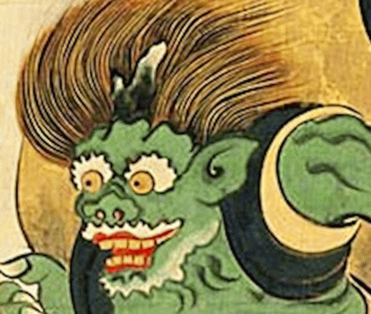
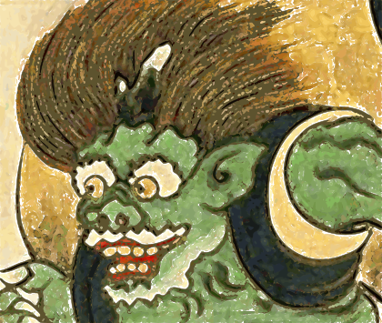

🌐 [English](./README.md)|**日本語**

# Vectrace

Vectrace は Peter Selinger氏 の開発されたベクトル化ライブラリ [Potrace](https://potrace.sourceforge.net) を基盤とし、用途の限定（入力：インデックスカラーの画像のみ、出力：SVGのみ）、機能の追加（SVGのカラーレイヤーに対応）を行った ビットマップ トレース ツール です。

実際には、 potrace を [cxgo](https://github.com/gotranspile/cxgo) を用いてGo言語へ直接機械翻訳（トランスパイル）したものを元にしており、純粋なGo言語で記述されています。（C言語の依存は排除）

カラーレイヤーごとの処理をマルチスレッド化することによって高速化を行っています。

## 対応入力形式（制限事項）

処理の効率化とカラー分解精度の維持のため、入力画像には以下の制限があります。**フルカラー（24bit/32bit）画像は直接読み込めません。** 事前に画像編集ソフト等で減色（インデックスカラー化）してください。特にカラー出力（`-C`）を使用する場合、入力は必ずパレット（インデックスカラー）形式である必要があります。

- **BMP**: 1bit / 4bit / 8bit（インデックスカラー、またはグレースケール）
- **PNG**: インデックスカラー（Palette形式）、または 8bit 以下のグレースケール

※ パレット（ユニークな色数）が256色を超えるとエラーになります（処理を中止します）。

## オプションフラグ

オプションフラグは potrace の 一般 オプション と アルゴリズム オプション の一部にのみ互換性があります。

### 互換性のあるフラグ

一般 オプション:

| フラグ        | 用途                   |
| ------------- | ---------------------- |
| -h, --help    | ヘルプメッセージを表示 |
| -v, --version | バージョン情報を表示   |
| -l, --license | ライセンス情報を表示   |

アルゴリズム オプション:

| フラグ                   | 用途                                                                                           |
| ------------------------ | ---------------------------------------------------------------------------------------------- |
| -a, --alphamax float     | 角の丸みを制御するしきい値 (default 1)                                                         |
| -n, --no-opticurve       | 曲線最適化を無効化する                                                                         |
| -O, --opttolerance float | 曲線最適化時の許容誤差 (default 0.2)                                                           |
| -o, --output string      | 出力ファイルパス（単一入力ソースの場合のみ有効。複数入力時は使用できません）                   |
| -t, --turdsize int       | 指定したピクセル数以下のノイズ（スペックル）を除去 (default 2)                                 |
| -z, --turnpolicy int     | パス分解時の分岐方向の決定ポリシー<br>(0:黒, 1:白, 2:左, 3:右, 4:少数派, 5:多数派, 6:ランダム) |
| -k, --blacklevel float   | 画像の2値化閾値 (default 0.5)                                                                  |

仕様の変更及び追加されたオプション:

| フラグ                | 用途                                                              |
| :-------------------- | ----------------------------------------------------------------- |
| -b, --bg-dilation int | 白い背景にアウトラインを作成するための追加の膨張回数 (default -1) |
| -C, --color           | カラー画像を複数のレイヤーに分割する                              |
| -K, --force-black     | ベースレイヤー（輪郭）を黒に強制する                              |

- bg-dilation は隙間が透過しないように最背面に配置する下地の白いマスク画像データを膨張させるサイズです。大きくするとオブジェクトが外側に白い輪郭を持つようになります。

- force-black は隣接する色と色の間に意図しない隙間や白い線ができないように "-k (閾値) フラグ" に基づき、画像内の暗い部分を抽出した黒い輪郭レイヤーを作成します。通常は抽出範囲の平均色を使用して作成されます。

- color はカラー画像を複数のレイヤーに分割してトレースします。このフラグが付いているとカラーSVGが出力されます。入力はパレット（インデックスカラー）形式が前提です。色数毎にレイヤーが増えていくので、色数の多い画像はファイルサイズと変換にかかる時間が大きく跳ね上がります。（その為256色以下と制限をかけています。）

## Vectrace-gui

WindowsとLinux向けの簡易的なGUIフロントエンドです。
起動後、対応する画像をドラッグ & ドロップで処理できます。
テキストボックスに記述しておくことでオプションフラグにも対応可能。（カラー出力には"-C"フラグが必須）

※ 実行には `vectrace.exe` が `vectrace-gui.exe` と同じディレクトリに存在する必要があります。また、GUI上ではファイルヘッダーを確認し、対応外の形式（フルカラー等）は無視されるようになっています。

## 使用例

**オリジナル画像**



**SVG画像**



## 使用方法

PNG画像をカラーSVGに変換する：

- "-C" フラグがないとモノクロSVGになります。

```
vectrace -C -o ./testdata/test.svg ./testdata/test.png
```

複数の画像をまとめてカラーSVGに変換する：

- ※画像が複数の場合は "-o" フラグは使用できません。

```
vectrace -C ./testdata/test1.png ./testdata/test2.png ...
```

### ヘルプ出力例

簡単なヘルプ出力は `vectrace --help` で表示できます。出力例（抜粋）：

```
Usage: vectrace [options] <input files>

Options:
	-h, --help           ヘルプメッセージを表示
	-v, --version        バージョン情報を表示
	-C, --color          カラー出力（パレット形式の入力が前提）
	-o, --output <file>  出力ファイル（単一入力時のみ有効）
```

### トラブルシュート（よくある問題と対処）

- パレット数が多すぎる（256色超）
    - 症状: 変換が中止される、またはエラーが表示される。
    - 対処: 画像を減色してパレットを256色以下にしてください（画像編集ソフトでの減色または `pngquant` 等のツールを利用）。

- フルカラー画像を与えた場合
    - 症状: 入力フォーマット非対応として無視されるか、期待した色分解が行われない。
    - 対処: 事前にパレット（インデックスカラー）へ変換してください。

- `-o` を使ったが複数ファイルを指定した
    - 症状: `-o` は単一入力時のみ有効です。
    - 対処: 複数ファイルをまとめて処理する場合は `-o` を使わず、各入力ごとに個別の出力を生成してください。

## ビルド方法

Vectrace は純粋なGo言語で記述されており、`CGO` および `GCC` 等は必要ありません。

### Windows

`vectrace.exe` と `vectrace-gui.exe` をビルドします。  
Windows用 `vectrace-gui` は `lxn/walk` で記述されており、こちらも `CGO` および `GCC` 等は必要ありません。

```
set CGO_ENABLED=0
set GOOS=windows
set GOARCH=amd64
go build -trimpath -ldflags="-s -w" -o vectrace.exe ./cmd/vectrace/
go build -trimpath -ldflags="-H windowsgui -s -w" -o vectrace-gui_win.exe ./vectrace-gui/windows/
```

または、提供されているバッチファイルを使用します。

```batch
build_windows.bat
```

### Linux

`vectrace` のみをビルドします。

```
export CGO_ENABLED=0
export GOOS=linux
export GOARCH=amd64
go build -trimpath -ldflags="-s -w" -o vectrace ./cmd/vectrace/
```

または、提供されているシェルスクリプトを使用します。

```bash
chmod +x build_linux.sh
./build_linux.sh
```

Linux用 `vectrace-gui` は `fyne.io/fyne` で記述されています。
こちらのビルドには `CGO` および `GCC` 等が必要になり、ビルド環境を整える必要があります。GUIをビルドする際は、使用するGoのバージョンや`CGO`設定、ネイティブライブラリが整っていることを確認してください。詳細は`go.mod`を参照してください。

Ubuntu / Debian 系の場合:

```bash
sudo apt update
sudo apt install build-essential libgl1-mesa-dev libx11-dev xorg-dev
```

Fedora / RHEL の場合:

```bash
sudo dnf groupinstall "Development Tools"
sudo dnf install libGL-devel libX11-devel
```

Arch Linux の場合:

```bash
sudo pacman -S base-devel libx11 libxcursor libxrandr libxinerama libxi libxxf86vm alsa-lib pkgconf
```

アプリケーションの構築

```bash
export CGO_ENABLED=1
export GOOS=linux
export GOARCH=amd64
go build -trimpath -ldflags="-s -w" -o vectrace-gui_linux ./vectrace-gui/linux/.
```

また、`fyne.io/fyne` はクロスコンパイルをサポートしていますので `MinGW-W64` 等の使用によりWindows版も構築可能です。

例：windows上で `MinGW-W64` を使用

```
set CGO_ENABLED=1
set GOOS=windows
set GOARCH=amd64
set CXX=x86_64-w64-mingw32-g++
set CC=x86_64-w64-mingw32-gcc
go build -trimpath -ldflags="-H windowsgui -s -w" -o vectrace-gui_win.exe ./vectrace-gui/linux/
```

## ライセンスと商標について

- ライセンス: 本プロジェクトは GNU General Public License v2.0 or later の下で公開されています。これはオリジナルの Potrace のライセンスを継承したものです。これはコピーレフトライセンスであり、Vectrace の派生物を公開する場合も同じライセンス条項を適用する必要があります。これにより、ソースコードの公開と改変の自由がすべてのユーザーに対して保証されます。
- 商標: "Potrace" は Peter Selinger 氏の商標です。本プロジェクトは公式の Potrace と混同を避けるため、名称を Vectrace としており、非公式の派生版であることを明示しています。詳細は [Potrace Trademark Policy](https://potrace.sourceforge.net/#trademarks) を参照してください。

---

Copyright

- Copyright (C) 2001-2019 Peter Selinger (Original Potrace)
- Modified by nyorotan 2026
